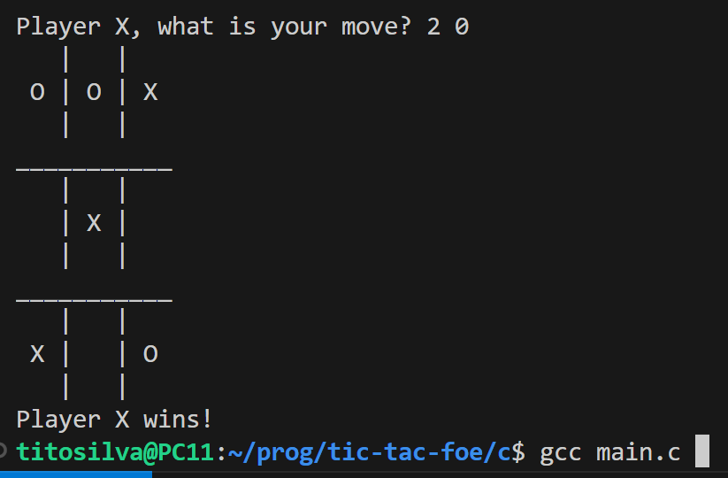

# Running the script

Compile the code with

```
$ gcc main.c
```

Then run with

```
$ ./a.out
```

The game is very simple. For each move, choose where to mark with a pair of numbers. E.g.:

```
Player X, what is your move? <row> <col>
```

