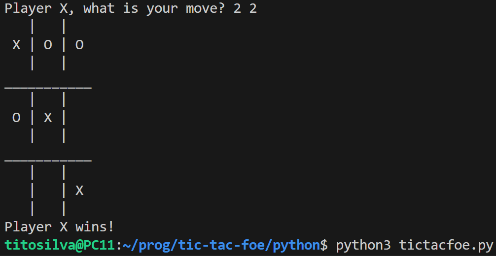

# Running the script

Just run

```
$ python3 tictacfoe.py
```

The game is very simple. For each move, choose where to mark with a pair of numbers. E.g.:

```
Player X, what is your move? <row> <col>
```

